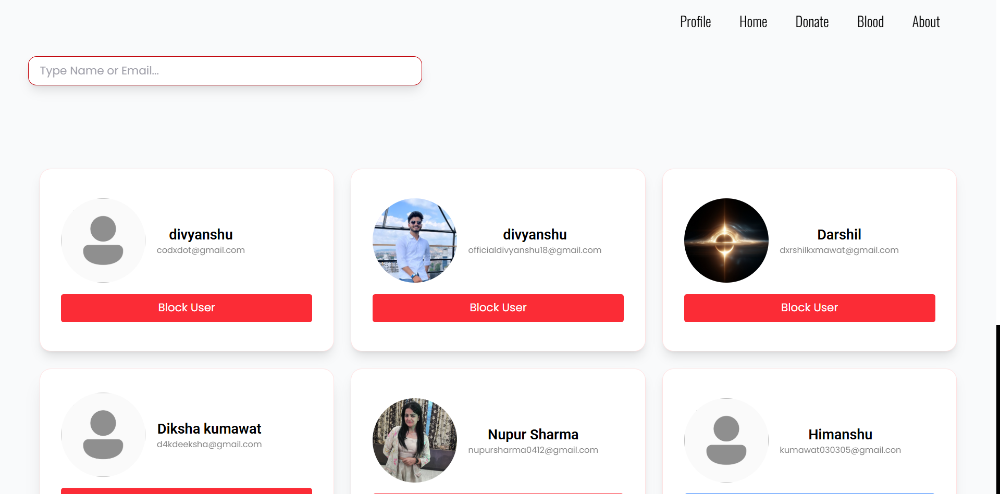

# 🧸 Blood Donation Website

---

<br/>

# 📖 Overview

_The Blood Hub Website is a full-stack platform designed to connect blood donors and receivers quickly and efficiently. It features real-time location tracking and routing between users using Leaflet.js and Leaflet Routing Machine — making it easier to save lives during emergencies._

---

# 🛠️ Tech Stack

- **Frontend:** React.js (Vite)
- **Backend:** Node.js, Express.js
- **Database:** MongoDB
- **Real-Time Communication:** Socket.IO
- **Maps & Location Tracking:** Leaflet.js + Leaflet Routing Machine

---

# ✨ Features

- 🔴 **Donor and Receiver Registration:** Easy signup and login system for both types of users.
- 🧽 **Live Location Tracking:** View nearby donors/receivers on an interactive Leaflet map.
- 🚳️ **Real-Time Routing:** Get the shortest route between donor and receiver using Leaflet Routing Machine.
- 🔒 **Secure Authentication:** Secure login and user data protection.
- 📋 **Blood Group Matching System:** Auto-match users based on blood type.
- 🧒‍♂️ **Fast Connection:** Save precious time by quick matching and live location sharing.

<br/>

# 🔁 Real-Time Features

- 📡 **Real-Time Updates:** Instant notifications when a matching blood type is available.

- 📡 **Live Blood Request Matching**: Donors and receivers matched based on blood group.

- 📡 **Real-Time Notifications**: Triggered when a new donor or request matches criteria.

- 📡 **Location Sharing**: Donors can share live location during the process.

---

<br/>

# 🚀 How to Run Locally

> # 🛑 **Important**: Backend Entry point or file is mainServer.js . 

## 1. Clone the Repositories

> **Backend Repository**

```bash
git clone https://github.com/Sc-Designs/Blood_hub_Backend

```
> ## Frontend Repository

```bash
git clone https://github.com/Sc-Designs/Blood_hub_Frontend
```

## 2. Setup Backend

```bash
cd Blood_hub_Backend
npm install
```

- ### Create a .env file inside /backend folder and add:

```js
MONGO_URI=your_mongodb_connection_string
PORT=Your_backend_server_port
SESSION_SECRET=bqfiuybfp9q7fq39f713qp937
HOSTER_CLR= // put the Gmail server protocol (smtp or something else)
GMAIL_USERNAME=Your_Gmail
PORT_CLR=Port_Number
PORT_SSL= // 465 or 587
GOOGLE_CLIENT_SECRET=Google_Auth_Secret_Key
GOOGLE_CLIENT_ID=Google_Client_Id
```
- ## Start Backend Server:

```bash
npm start
```
or
first download the nodemon packdge from npm
```bash
npm install nodemon
npx nodemon mainServer.js
```

## 3. Setup Frontend

```bash
cd Blood_hub_Frontend
npm install
```
- ## Start Frontend Server:

```bash
npm run dev
```

## 4. Open in Browser

Visit http://localhost:5173 to access the React app.

<br/>

# 🌐 Deployment

### The live version of the application is available at: 
https://bloodcenter.netlify.app/


# 📸 Screenshots

- ## Homepage View


- ## Profile View


- ## Blood History View


- ## Admin View


- ## All User In Admin side View



<br/>

# 📢 Future Improvements
- ✉️ SMS Notifications: Send alerts when a matching donor is found.

- 🏥 Hospital Management System: Allow hospitals to request blood

- 🤖 AI Based Matching: Suggest best matches based on availability and location.

<br/><br/>

# 🏗️ Backend EndPoint

# Admin EndPoint

>> ## POST /admin/register

| **Filed** | **Requered** |
| ------ | ------|
| Name | Yes |
| Email | Yes |
| password | Yes |

> ## Notice For Admin Register

- This end Point work in `Postman`

<br/><br/>

>> ## POST /admin/login

| **Filed** | **Requered** |
| ------ | ------|
| Email | Yes |
| password | Yes |

<br/><br/>

>> ## POST /admin/allcounts

- This endpoint returns all `User` details in an array format:

```js
    allUser = [...{User}]
```

<br/><br/>

>> ## POST /admin/adminPic

- Upload a profile picture. The image is stored as a `Buffer` in MongoDB Atlas. 

<br/><br/>

>> ## POST /admin/ticket-maker

- This endpoint creates a ticket by asking for a `TicketTitle` and `Description`.

<br/><br/>

>> ## POST /admin/ticket

- This endpoint returns all tickets raised by the admin in array format:

```js
 allTicket = [...{Ticket}]
```

<br/><br/>

# Users EndPoint

>> ## POST /users/register

| **Filed** | **Requered** |
| ------ | ------|
| Name | Yes |
| Email | Yes |
| password | Yes |

If any user registers with Google, then: 

| **Scoped** | **Requered** |
| ------ | ------|
| Email | Yes |
| Name | Yes |

- After registration, it sends specific data of the User:

```js
    User = {
        name: "",
        email: "",
        profilePic: "",
        verified: // true or false ,
        bloodRequest: [],
        donate: [],
        pictype: // default image/png
    } 
```
Then, it sends the OTP to the Gmail for authorization.

<br/><br/>

>> ## POST /users/login

| **Filed** | **Requered** |
| ------ | ------|
| Name | Yes |
| Email | Yes |
| password | Yes |

If any user registers with Google, then:

| **Scoped** | **Requered** |
| ------ | ------|
| googleId | Yes |

```js
    User = {
        name: "",
        email: "",
        profilePic: "",
        verified: true ,
        bloodRequest: [],
        donate: [],
        pictype: // default image/png
    } 
```

<br/><br/>

> ## POST /users/otp-verify

- If the user opens the account for the first time, this endpoint changes the verified field in the database to true if the OTP matches and hasn't expired.

- OTP expiry time: 60 seconds.

- After verification, it sends a welcome message to the User.

<br/><br/>

> ## POST /users/resendOtp

- This endpoint finds the User again and sends a new OTP to their Gmail.

<br/><br/>

> ## POST /users/alldets

- This endpoint sends all the blood requests in an array format:

```js
    allPost = [...allPost]
```

<br/><br/>

> ## POST /users/picture-upload

- This endpoint looks for an image from the authorized user, which will be saved as the profile picture in the database in `Buffer` format.

<br/><br/>

# Donar EndPoint

> ## POST /donar/donateDets

- This endpoint sends all the `pending` blood donation posts.

<br/><br/>

# NODE VERSION

- This website backend code runs on `Node v22.14.0`.

<br/><br/>

# 🩸 Blood Hub — Website Architecture


<br/><br/>

# Website Diagram

```pgsql
[User (Browser)]
     ↓
 [Frontend (React)]
     ↓ (HTTP Request)
 [Backend (Express.js Server)]
     ↓ (Database Query)
 [MongoDB Atlas Database]

+-------------------------------------------+
|                                           |
|        Real-Time (Socket.IO)              |
|   - Location sharing                      |
|   - Real-time notifications               |
|                                           |
+-------------------------------------------+

```

<br/> <br/>

# User Flow

- User registers or logs in.

- Requester posts a blood request.

- System matches based on blood type.

- Real-time sent to matching users Frontent with Socket.Io .

- After successful donation, the database is updated.

<br/> <br/>

# Example User Journey

```pgsql
User logs in → User requests for blood → Server matches donor → 
Send the available donar frontend side with Socket.Io →
Both users get connected via notification → Blood donation completed →
Database updated
```

<br/> <br/>

# 🗂️ Project Structure

## **Frontend (React + Vite)**

- **src/components/**: Reusable UI components

- **src/pages/**: Page components (Home, Login, Donor, Receiver, etc.)

- **src/context/**: Global state (User, Admin, Donate, AllUsers)

- **src/utils/**: Navbar function

- **src/assets/**: PDFs, Fonts

- **src/config**: Initializes and manages Socket.IO client, Admin Axios, User Axios

- **src/auth**: Authenticator (Admin, User)

- **src/Routes**: All Route Location

## **Backend (Express.js)**
- **routes/**: API routes (/adminRouter, /usersRouter, /googleAuthenticatorRouter, /donarRouter, /pdfGenerator)

- **controllers/**: Core logic for Admin, Blood Request, Google Signin and Login, Pdf Generator, User

- **models/**: Mongoose schemas (User, Request, Admin, Ticket)

- **middlewares/**: JWT auth, error handling (User and Admin)

- **utils/socket.io.js**: Handles real-time Socket.IO connections/events

- **socketAllFuntions**: Handel all the event funtions

<br/> <br/>

# 🔐 User Flow with Authentication

1. User registers or logs in (token issued).

2. Token stored in localStorage.

3. All protected routes and Socket.IO connections use this token.

4. Backend verifies JWT before granting access or emitting events.

<br/> <br/>

# 📦 API + Socket Flow
### **Example: Blood Request Flow**
1. Receiver submits blood request via frontend.

2. Frontend sends POST request to backend.

3. Backend saves the request to MongoDB.

4. Backend emits a new-request event via Socket.IO.

5. All connected donors with matching blood types receive real-time updates.

<br/> <br/>

# 👌 Thank you for using the Blood Hub Website!

### Together, we can save lives. ❤️